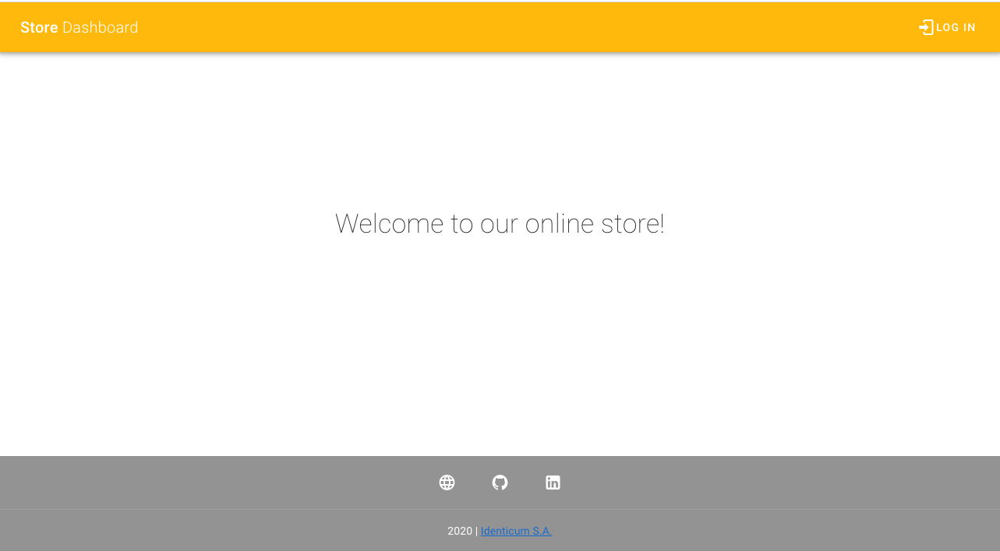
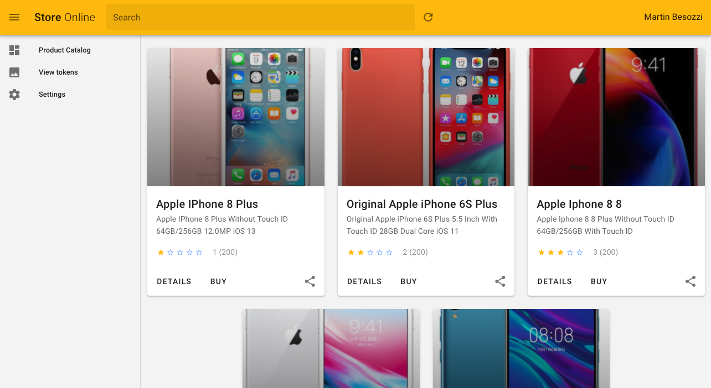
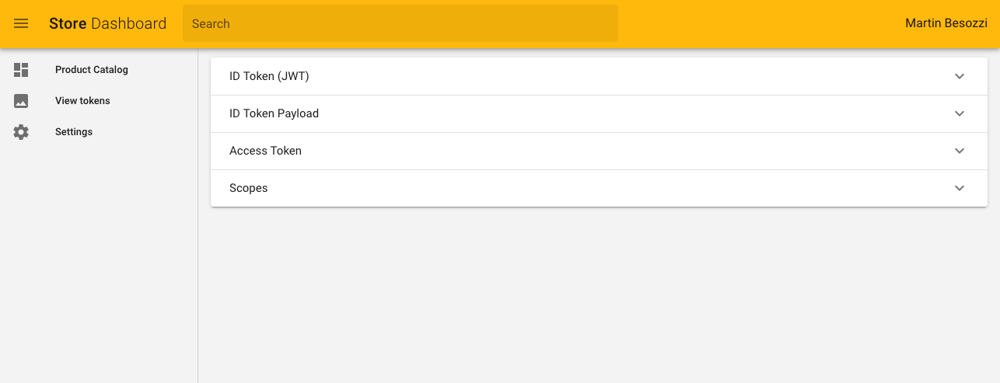

# oidc-demoapp-vue
OpenID Connect (OIDC) demo app vue using using library [oidc-client](https://github.com/IdentityModel/oidc-client-js).
Authentication flow data is handled by Vuex.

Support:
* OpenID Connect Authentication (Flow Authorization Code with PCKE)
* Token Negotiation
* OAuth API Call

In order to test the API call, you can use our Git Hub [OAuth demo API](https://github.com/Identicum/oauth-demoapi-spring).

# Installation

Clone this repository
```
git clone git@github.com:https://github.com/Identicum/oidc-demoapp-vue.git
```

# Configure and run
1. Adjust the oidc client parameters in the file [oidc-client.js](src/oidc/oidc-client.js)

2. Compile & run:
```
npm run serve
```
You can access to the UI on http://hostname:8080/

3. Change configuration:

Go to the app section Settings and change the configuration


# Screenshots






